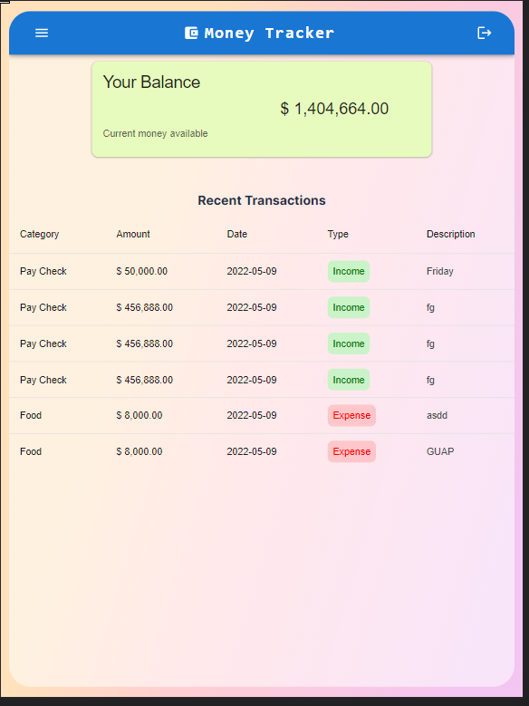

# WebApp built for the FullStack challange from Alkemy
   This project is far from finished but is the farthest I could come given the amount of time I had in my hands.
   Hopefully is enough to advance the next stage

# Expense-Income Tracker with JWT/Auth 
   At the WebApp you can see your current balance, you can create transactions as well you are able to edit and delete. 
   This project was built using: -ReactJS (v18.1.0) -NodeJS (v17.7.2 ) -Express(v4.18.1) -Sequelize (V6.19.0)
   
   The data base is a PostgreSql db, at the .env file you should change the variables POSTGRESDB, POSTGRESUSER,POSTGRESPASS and POSTGRESHOST so you can connect to your own db.   
   
   In the .env file, you can find all the key variables, feel free to change them. 

Once you get the up running, sign up to have your own data.

# Run Commands on Root folder

*Install all dependencies

    npm i

*Start Server

    npm run dev

# Run Commands on Client folder

*Install all dependencies

    npm i

*Start React App

    npm start

*Second time lunch (will run server and client only)

I will try to upload this project to Heroku now that they have local postrgesql database on their site.  

# Mean while you can check this To-do app fully functional

    https://todo-auth-mern.herokuapp.com/login

# Images of the running app

